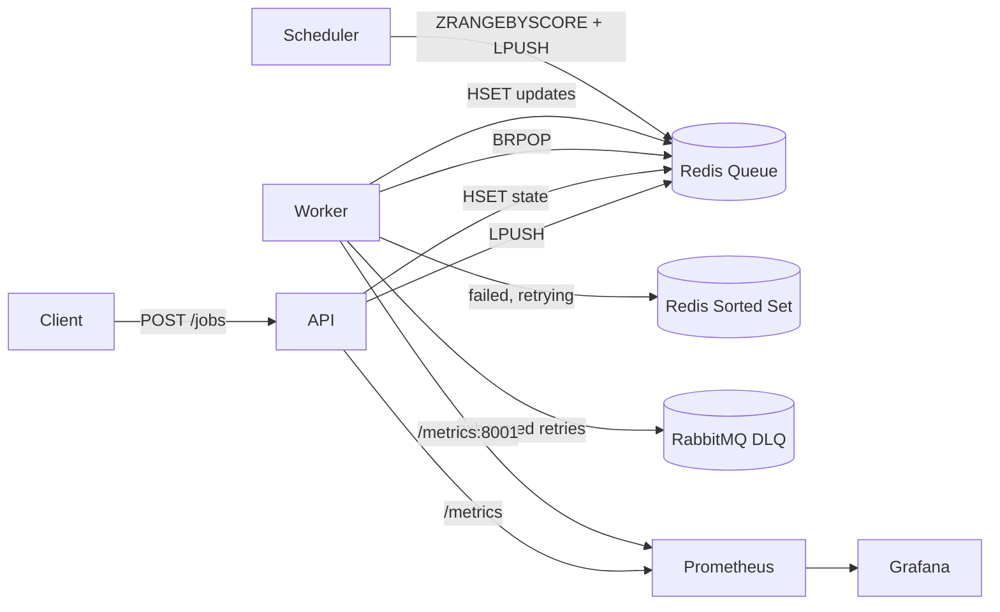

# Phase 7 — Documentation
**Estimated time: 2–3 hours**

Goal: A README that stands on its own. A hiring manager who clones this repo and reads the README should understand the problem, the architecture, and how to run it — without asking you a single question.

---

## Step 7.1 [BUILD YOURSELF] — Write full `README.md`

Replace the current two-line placeholder. The README has six required sections, in this order.

---

### Section 1: Problem Statement

Write 4–6 sentences explaining:
- What FlowCore is (a generic distributed task queue)
- The problem it solves (decoupling producers from consumers in high-throughput systems)
- What breaks without it (tight coupling, cascading failures when a downstream service is slow, no retry on transient errors, no audit trail for failures)
- What class of systems it applies to (payments, notifications, document processing, data pipelines)

Example opening you can expand:

> FlowCore is a distributed task queue designed to decouple job producers from consumers in high-throughput backend systems. Without a queue, services call each other directly — a slow payment processor holds up the entire API, a transient network error causes the caller to fail, and there is no record of what was attempted. FlowCore accepts jobs over HTTP, persists them in Redis, and processes them asynchronously with configurable retry logic and a durable dead-letter queue for permanently failed jobs.

---

### Section 2: Architecture Diagram

Use a Mermaid diagram block — GitHub renders it natively:

```markdown

```

Follow the diagram with a one-paragraph description of the data flow: job enters via API → stored in Redis hash → enqueued in Redis list → worker BRPOPs → executes → on failure retries via sorted set delay mechanism → on exhaustion publishes to RabbitMQ DLQ.

---

### Section 3: 3-Command Local Setup

This section must work for any developer cloning from zero. Test it yourself before publishing.

```markdown
## Quick Start

**Prerequisites**: Docker Desktop

```bash
# 1. Clone and configure
git clone https://github.com/<username>/FlowCore.git && cd FlowCore && cp .env.example .env

# 2. Start all services
docker-compose up --build -d

# 3. Submit a test job
curl -X POST http://localhost:8000/jobs \
  -H "Content-Type: application/json" \
  -d '{"payload": {"task": "demo", "message": "Hello FlowCore"}}'
```

**Verify it's working:**

| What | URL / Command |
|---|---|
| API health | `curl http://localhost:8000/` |
| Job status | `curl http://localhost:8000/jobs/<job_id>` |
| Worker logs | `docker-compose logs -f worker` |
| Grafana dashboard | `http://localhost:3000` (admin/admin) |
| Prometheus targets | `http://localhost:9090/targets` |
| RabbitMQ DLQ | `http://localhost:15672` (guest/guest) → Queues |
```

---

### Section 4: "What Breaks and How It Recovers"

This section is what you read aloud in interviews. Document every failure mode in a table.

```markdown
## Failure Modes and Recovery

| Failure | How It's Detected | Recovery Mechanism | Data Loss Risk |
|---|---|---|---|
| Worker crashes mid-execution | Job status stays `RUNNING` forever | Future work: add a timeout watcher that sweeps `RUNNING` jobs older than N seconds back to `PENDING` | Possible — job must be re-executed |
| Redis restarts | Queue and job state lost | Enable `appendonly yes` in Redis config — AOF persistence replays the write log on restart | None with AOF enabled |
| RabbitMQ restarts | In-flight DLQ messages lost | DLQ uses `durable=True` queue + `delivery_mode=2` messages — both survive broker restart | None for messages already published |
| `execute_task` raises exception | Exception caught in worker try/except | Retry with exponential backoff up to `max_retries`, then route to DLQ | None — job tracked in Redis hash |
| All retries exhausted | `attempts >= max_retries` in `handle_failure` | Publish to RabbitMQ DLQ, set status `DEAD` | None — job preserved in DLQ |
| API service crashes | HTTP 503 to clients | Docker `restart: always` restarts the container | None — queued jobs survive in Redis |
| Duplicate job delivery | Status check at start of `process_job` | Guard clause skips jobs not in `PENDING` status — idempotent | None |
| Scheduler crashes | Delayed jobs never promoted back | Scheduler is a daemon thread in the worker process — restarts when the worker container restarts | Jobs stuck in delayed set until worker restarts |
```

---

### Section 5: Key Design Decisions

Document three decisions you must be able to defend:

```markdown
## Design Decisions

**Redis Lists vs Redis Streams**
FlowCore uses Redis Lists (`LPUSH`/`BRPOP`) for the primary queue. Lists are simpler: LPUSH enqueues, BRPOP dequeues atomically. The alternative, Redis Streams (`XADD`/`XREADGROUP`), adds consumer groups, message acknowledgment, and replay — at the cost of more operational complexity. Streams are the right choice for at-least-once delivery in production. FlowCore chooses Lists for clarity; it is straightforward to swap the queue layer once the rest of the system is understood.

**ZREM before LPUSH in the scheduler**
When promoting a delayed job back to the main queue, FlowCore calls `ZREM` before `LPUSH`. If the process crashes between the two operations, the job is lost (at-most-once delivery). The reverse order — `LPUSH` then `ZREM` — would guarantee at-least-once delivery but risks double-processing. Financial systems typically choose at-least-once + idempotency keys to ensure no operation is silently skipped. FlowCore chooses at-most-once for simplicity and documents the trade-off explicitly.

**Threading vs multiprocessing**
Workers use Python threads for concurrency because the workload is I/O-bound: threads spend most of their time waiting on Redis (BRPOP) and external services. Python's GIL releases during I/O, so threads are effective here. If `execute_task` were CPU-bound (ML inference, image processing), the right choice would be `multiprocessing.Pool` or independent worker containers to bypass the GIL.
```

---

### Section 6: Monitoring

```markdown
## Monitoring

| Service | URL | Credentials |
|---|---|---|
| Grafana | http://localhost:3000 | admin / admin |
| Prometheus | http://localhost:9090 | — |
| RabbitMQ | http://localhost:15672 | guest / guest |

**Metrics**

| Metric | Type | Description |
|---|---|---|
| `jobs_submitted_total` | Counter | Total jobs enqueued, labelled by initial status |
| `queue_depth` | Gauge | Current number of jobs waiting in Redis |
| `jobs_failed_total` | Counter | Execution failures, labelled `transient` or `permanent` |
| `jobs_retried_total` | Counter | Total retry attempts scheduled |
| `job_processing_duration_seconds` | Histogram | End-to-end job duration; P95 query: `histogram_quantile(0.95, rate(job_processing_duration_seconds_bucket[5m]))` |
```

---

## Step 7.2 [CHECKPOINT] — Final End-to-End Validation

Start from a completely clean state. Run `docker-compose down -v` first — this removes all volumes, clearing Redis data and RabbitMQ queues.

**All nine checks must pass for FlowCore to be complete:**

**Check 1 — Clean startup**
```bash
docker-compose down -v
docker-compose up --build -d
docker-compose ps  # all six services healthy
```

**Check 2 — Bulk submission**
```bash
for i in $(seq 1 50); do
  curl -s -X POST http://localhost:8000/jobs \
    -H "Content-Type: application/json" \
    -d "{\"payload\": {\"id\": $i}}" > /dev/null
done
```

**Check 3 — All jobs reach terminal state**
Wait 60 seconds. Then poll a sample of job IDs — all should show `COMPLETED` or `DEAD`. None should be stuck in `PENDING` or `RUNNING`.

**Check 4 — Grafana shows activity**
Open `http://localhost:3000`. All five panels should have non-zero data.

**Check 5 — DLQ has messages**
Open `http://localhost:15672` → Queues → `flowcore:dlq`. Message count should be non-zero (some jobs hit the 20% failure rate and exhausted retries).

**Check 6 — Tests pass**
```bash
pytest tests/unit/ tests/integration/ -v
```

**Check 7 — CI is green**
Open `https://github.com/<username>/FlowCore/actions`. All four jobs show green.

**Check 8 — README setup works from clean clone**
On a second machine or a fresh directory: follow exactly the three commands in the README. Verify the job submission returns a valid response.

**Check 9 — CI badge is in the README**
The badge should show green in the GitHub repository view.

---

## Project complete

At this point, FlowCore is a production-credible demonstration of:

1. **Queue mechanics** — Redis LPUSH/BRPOP, atomic dequeue, no double-processing
2. **State management** — Redis Hash as job ledger, full status history per job
3. **Retry architecture** — exponential backoff, delayed sorted set, per-job configuration
4. **Dead-letter queuing** — durable RabbitMQ messages, explicit failure audit trail
5. **Observability** — five named Prometheus metrics, live Grafana dashboard, structured JSON logs
6. **Testing** — unit tests with mocks, integration tests against real services, `FLUSHDB` isolation
7. **CI/CD** — four-job GitHub Actions pipeline, lint + unit + integration + build

This is the full picture of an async job processing system at the level expected by any team running payments, notifications, data pipelines, or document processing at scale.
